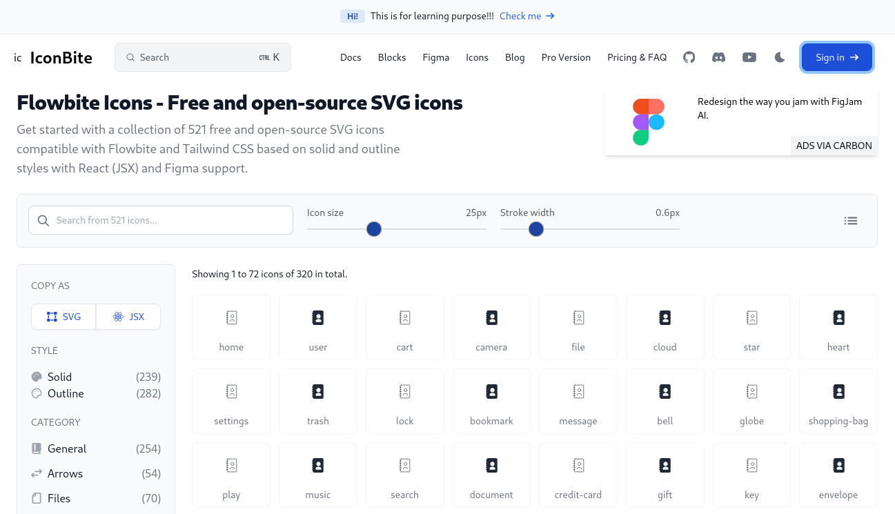
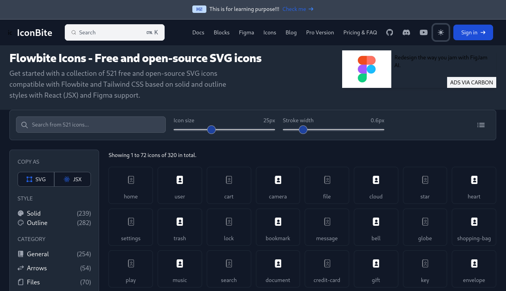
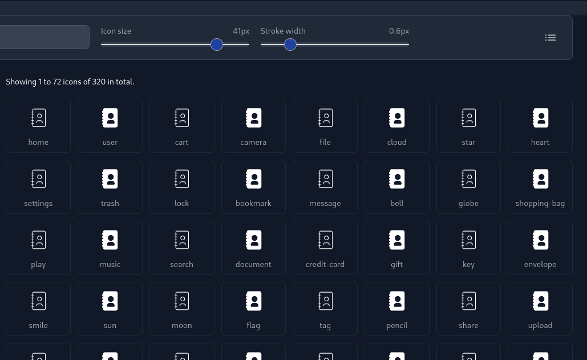
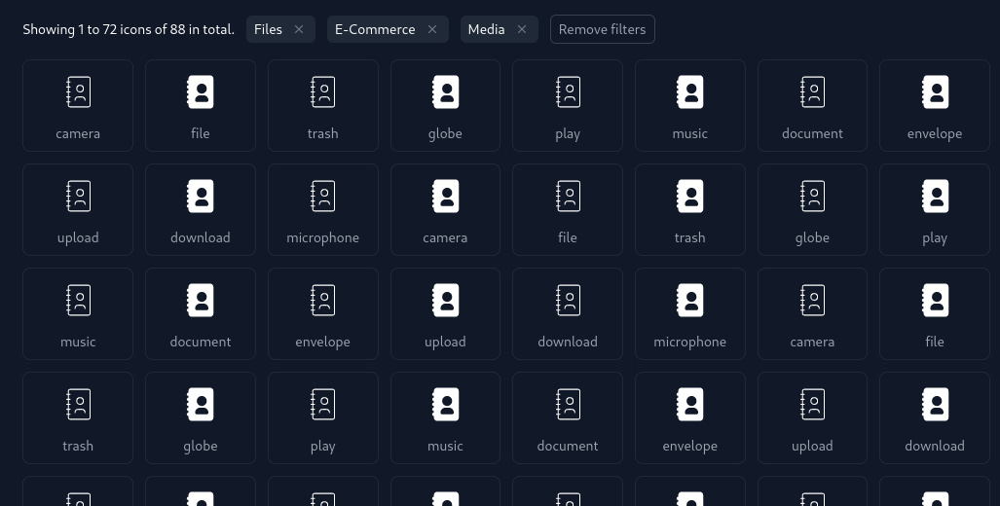

# Flowbite Icons

This project is a React-based implementation of an icons page, inspired by Flowbite. It includes features such as light/dark mode, icon categorization, and advanced filter and search functionality.

## Features

- **Light/Dark Mode**: Toggle between light and dark themes for improved user experience.
- **Icon Display**: A wide variety of icons are showcased with proper categorization.
- **Filter and Search**: Advanced filtering and search options to quickly find the desired icons.

## Installation

Follow these steps to set up the project locally:

### Prerequisites

- Node.js - v20
- npm 

### Steps

1. **Clone the repository**

   ```
   git clone https://github.com/Parvez49/FlowbiteIcons
   cd FlowbiteIcons/frontend
2. **Install dependencies**
  ```
  npm install
  npm start
  ```
The application will be available at http://localhost:3000.







